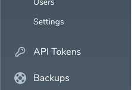

# Nova Laravel Passport

A custom tool to manage Passport API keys in Nova



## Installation

You can install the package in to a Laravel app that uses [Nova](https://nova.laravel.com) via composer:


```bash
composer require niveshsaharan/laravel-passport
```

Then, register your new link in the `tools` method of the `NovaServiceProvider`.

```php
// in app/Providers/NovaServiceProvider.php

[..]
use Niveshsaharan\LaravelPassport\LaravelPassport;

class NovaServiceProvider extends NovaApplicationServiceProvider
{

[..]

public function tools()
{
    return [
        // ...
        (new LaravelPassport())->canSee(function ($request) {
                return true; //$request->user()->isAdmin();
        }),
    ];
}

[..]

}
```
